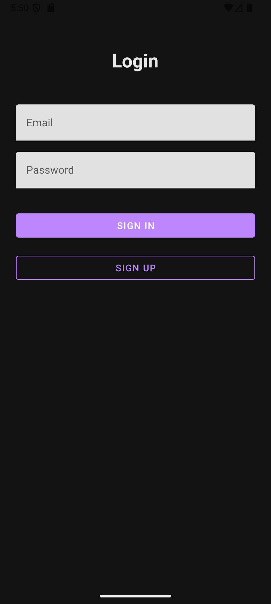
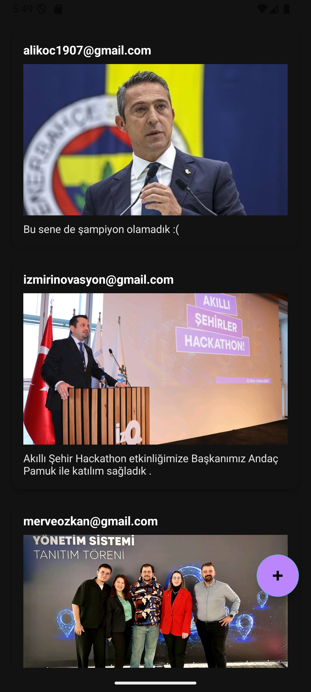

# 📸 Firebase Photo Sharing Android App

This project is an Android application that allows users to register and log in with their email, upload photos with descriptions, and view a real-time feed of photos shared by all users. The app leverages Firebase services for authentication, data storage, and media hosting.

---

## 🚀 Features

- 🔐 User registration and login via Firebase Authentication (Email/Password)
- 📷 Upload photos from gallery to Firebase Storage
- ✏️ Add descriptions to uploaded photos
- 📰 Real-time feed displaying photos and descriptions from all users using Firestore
- 🧭 Smooth navigation using Android Navigation Component
- 🖼 Efficient image loading with Picasso
- ☁️ Real-time database updates with Firestore

---

## 🛠️ Technologies Used

| Technology             | Description                       |
|-----------------------|---------------------------------|
| Kotlin                | Android programming language     |
| Firebase Authentication | User authentication              |
| Firebase Firestore    | Real-time NoSQL database          |
| Firebase Storage     | Media upload and storage           |
| Picasso              | Image downloading and caching     |
| Navigation Component | Navigation and fragment management |

---

## ⚙️ Installation & Setup

> **⚠️ IMPORTANT:** API keys and `google-services.json` are excluded from version control for security reasons. Please follow the steps below to configure your environment.

### 1. Create a Firebase Project

- Go to [Firebase Console](https://console.firebase.google.com/) and create a new project.
- Enable **Email/Password** sign-in method under Authentication.
- Set up **Cloud Firestore** database.
- Configure **Firebase Storage** for media uploads.

### 2. Register Your Android App in Firebase

- Add a new Android app to your Firebase project.
- Use your app’s package name (e.g., `com.example.fotografpaylasimi`).
- Download the generated `google-services.json` file.
- Place the `google-services.json` file into your app’s `app/` directory.

### 3. Add Firebase SDK & Plugins

Add the following in your **project-level** `build.gradle`:

```gradle
classpath 'com.google.gms:google-services:4.3.15' // Use the latest version available
```

Add the following in your **app-level** `build.gradle`:

```gradle
apply plugin: 'com.google.gms.google-services'

dependencies {
    implementation platform('com.google.firebase:firebase-bom:32.3.1') // Use the latest BOM version
    implementation 'com.google.firebase:firebase-auth-ktx'
    implementation 'com.google.firebase:firebase-firestore-ktx'
    implementation 'com.google.firebase:firebase-storage-ktx'
    implementation 'com.squareup.picasso:picasso:2.71828'
}
```

---

## 📱 Screenshots 

<p align="center">
  
  &nbsp;&nbsp;
  
</p>

---

## 📂 Project Structure

```
├── adapter/
│   └── PostAdapter.kt         → RecyclerView adapter for displaying posts
├── model/
│   └── Post.kt                → Data model class
├── view/
│   ├── MainActivity.kt
│   ├── UserFragment.kt       → Handles login and registration
│   ├── FeedFragment.kt       → Displays the photo feed
│   └── UploadFragment.kt     → Photo upload UI and logic
├── res/
│   ├── layout/                → XML layout files
│   └── values/strings.xml     → String resources including API keys (should be protected)
├── AndroidManifest.xml
└── build.gradle
```

---

## 📄 License

This project is licensed under the Apache License 2.0. See the `LICENSE` file for details.


## 🤝 Contribution

Pull requests are welcome! For commercial use please inform me.

---

## 👨‍💻 Developer

**Kerem Levent**  
📧 [keremleventt@gmail.com](mailto:keremleventt@gmail.com)  
🔗 [LinkedIn Profile](https://www.linkedin.com/in/keremlevent/)
  
